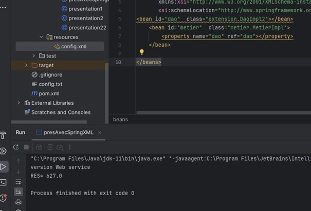

<h1>Compte rendu de l'activité Pratique N° 1 - Injection des dépendances </h1>
Grami salma 
<h3>Introduction</h3>

Plutôt que de créer des instances de dépendances directement dans une classe, l'injection de dépendances permet d'injecter ces dépendances depuis l'extérieur. Cela réduit le couplage(faible) entre les classes, ce qui les rend plus indépendantes et plus réutilisables. 

 
<h3>Enonce</h3>
1. Créer l'interface IDao avec une méthode getDate
 
2. Créer une implémentation de cette interface 
 
3. Créer l'interface IMetier avec une méthode calcul
 
4. Créer une implémentation de cette interface en utilisant le couplage faible
 
5. Faire l'injection des dépendances :

  a. Par instanciation statique

  b. Par instanciation dynamique

  c. En utilisant le Framework Spring

       - Version XML

       - Version annotations
 
<h3>Conception</h3>

 

<h3>Captures ecran </h3>
Faire l'injection des dépendances :

a. Par instanciation statique

 
 

L'instantiation statique n'est pas une bonne pratique car elle instancie directement les classes plutôt que les interfaces.
Ainsi, si des changements sont nécessaires à l'avenir, les développeurs sont obligés de modifier le code source directement. 

 
 

b. Par instanciation dynamique

 
 

L'instanciation dynamique est une bonne pratique qui respecte le couplage faible, où l'on crée un 
fichier texte config.txt : la première ligne contient la couche DAO et la deuxième ligne contient la couche
métier à utiliser. Ensuite, dans la couche présentation, on instancie dynamiquement les classes avec forName() et
.getConstructor().newInstance(), mais comme ça se répète
, on cherche mieux pour automatiser ce flux, d'où l'utilisation du framework Spring qui automatise tout ça. 

 
 

c. En utilisant le Framework Spring

 
 

       - Version XML

 
 

Spring lit les interfaces à injecter et les dépendances depuis un fichier de configuration
, généralement nommé config.xml, où il trouve les beans et les propriétés nécessaires.
Ce fichier de configuration est utilisé par la couche de présentation de l'application.
Pour travailler avec cette méthode, il est nécessaire de télécharger trois dépendances principales : 
Spring Framework, Spring Context et Spring Beans.

 
 

       - Version annotations

Spring utilise les annotations comme alternative aux fichiers XML pour configurer et gérer la partie technique d'un projet, offrant ainsi une approche plus concise et plus facile à maintenir.

<h3>Conclusion</h3>

En résumé, dans ce TP en manipulant différents modes d'injection, nous avons bien compris le principe clé de Spring, et aussi cela renforce nos capacités à développer des applications fermées à la modification et ouvertes à l'extension.
